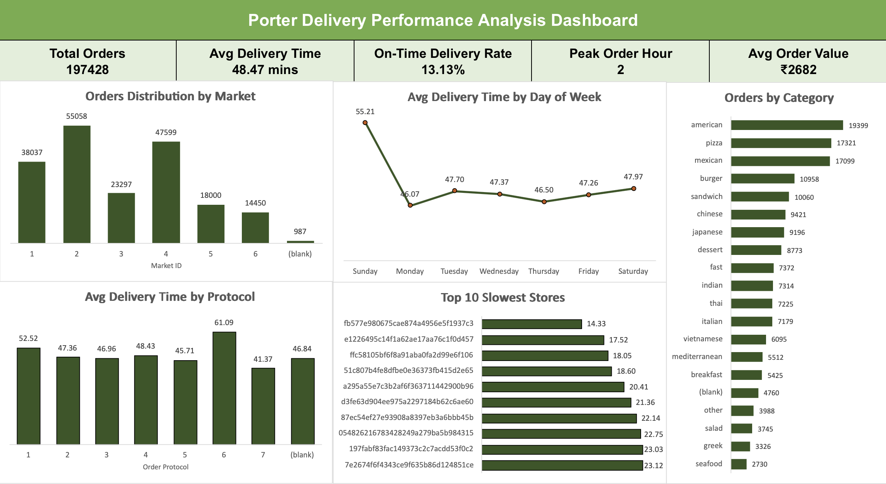

# Porter Delivery Dashboard Analysis

A professional **data analytics dashboard** analyzing Porter delivery operations.  
The dashboard highlights **order patterns, delivery performance, partner workload, and operational efficiency across markets and store categories**.

---

## Dashboard Preview



---

## Key Performance Indicators (KPIs)

| KPI | Value |
|-----|-------|
| **Total Orders** | 197,428 |
| **Average Delivery Time** | 48.47 mins |
| **Orders Delivered within 30 mins** | 25,929 (13.13%) |
| **Average Order Value** | ₹2,682 |
| **Peak Order Hour** | 2 |

---

## Dashboard Components

### 1. Orders Distribution by Market
- Visualizes the **total order volume across different markets**.
- Helps identify **high-demand markets** and potential resource allocation needs.

### 2. Average Delivery Time by Day of Week
- Shows **delivery performance trends throughout the week**.
- Highlights days with **higher delivery times due to demand spikes**.

### 3. Orders by Store Category
- Displays **top cuisine categories by order volume**.
- Useful for identifying **popular food categories and demand trends**.

### 4. Average Delivery Time by Order Protocol
- Compares **delivery efficiency across different order processing protocols**.
- Helps determine **which protocol performs best operationally**.

### 5. Top 10 Slowest Stores
- Identifies stores with the **longest delivery times**.
- Useful for **operational improvement and performance monitoring**.

---

## Key Insights

- **Market Distribution**
  - Market 2 has the **highest order volume**.
  - Market 4 shows **greater delivery time variability**.

- **Delivery Performance**
  - Average delivery time is **48.47 minutes**.
  - Only **13.13% of orders are delivered within 30 minutes**.

- **Demand Trends**
  - **Peak order hour:** 2
  - **Busiest days:** Sunday and Monday.

- **Operational Efficiency**
  - Protocol **7 performs the fastest**, while protocol **6 shows the slowest delivery time**.
  - Increased partner workload correlates with **slightly higher delivery times during peak hours**.

---

## Tools Used

- **Microsoft Excel**
  - Pivot Tables
  - Pivot Charts
  - Dashboard Design
  - Data Cleaning & Transformation

- **Data Analysis Techniques**
  - Aggregation
  - Correlation Analysis
  - Performance Metrics
  - Operational Insights

---

## Project Structure
```
porter-delivery-dashboard
│
├── Porter_Delivery_Dashboard.xlsx
├── Porter_Delivery_Data_Analysis_Report.pdf
├── dashboard.png
└── README.md
```


---

## Author

**Bhargav Kumar**
